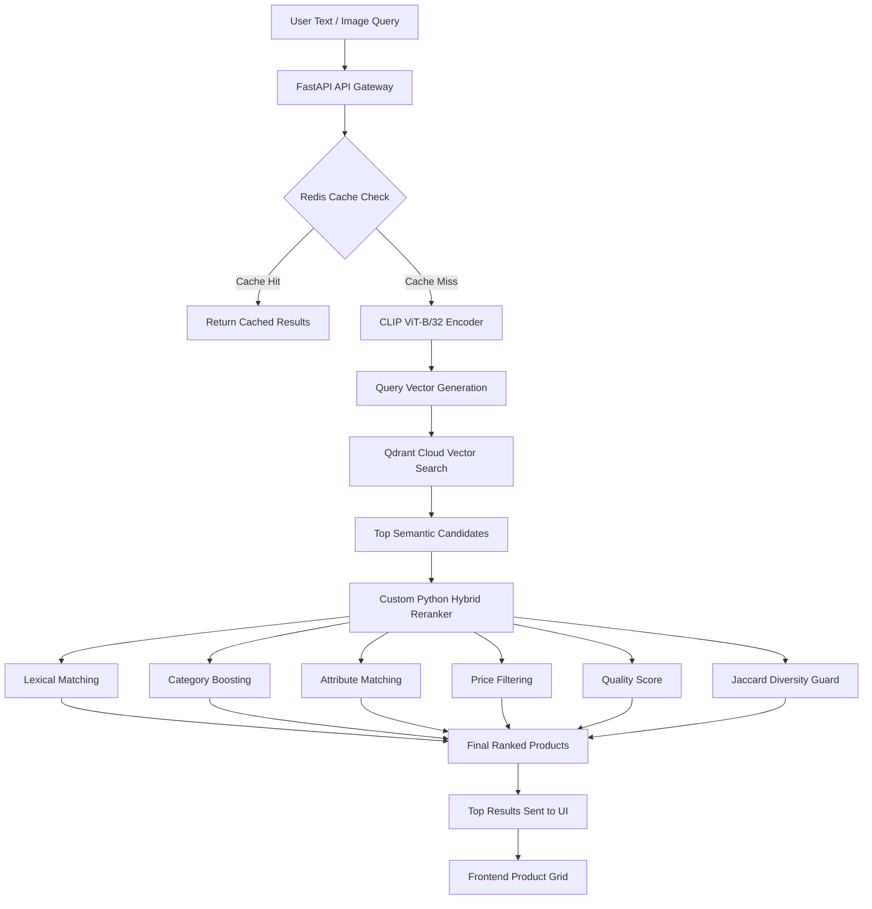
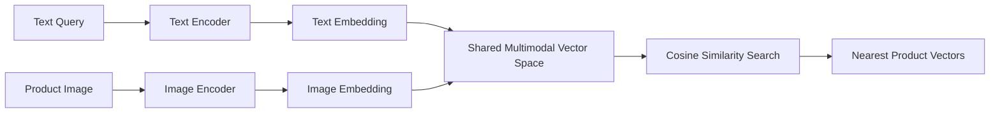
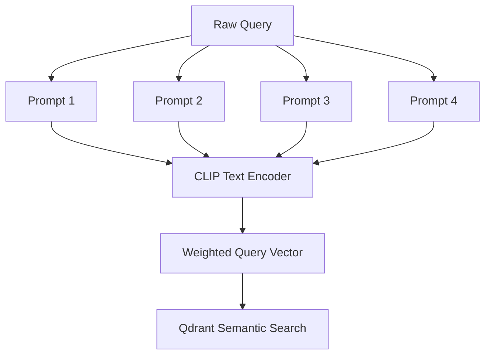
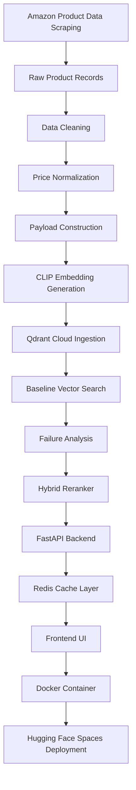
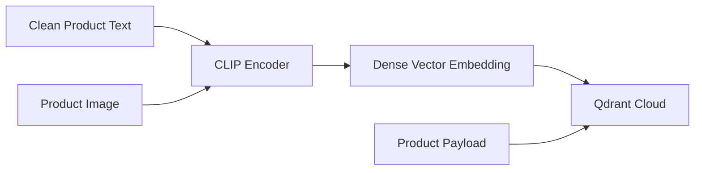
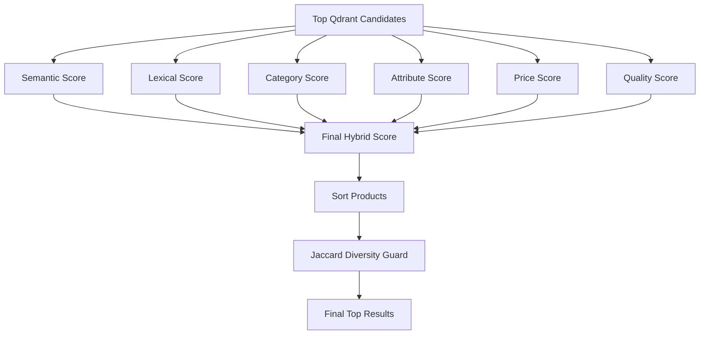
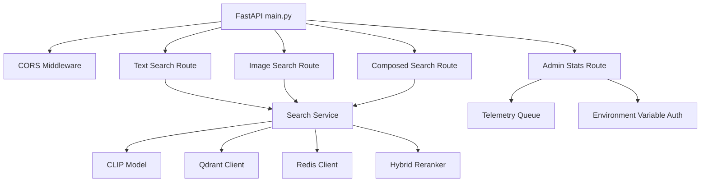

# 🚀 Multimodal E-Commerce AI Search Engine


An enterprise-style **multimodal hybrid search engine** for e-commerce platforms, designed to retrieve products using **text queries, image queries, and image + text composed search**.

This project combines the semantic power of **OpenAI CLIP**, the scalability of **Qdrant Cloud**, the speed of **Upstash Redis**, and a custom **business-aware hybrid reranking engine** to make product search more accurate, diverse, and realistic for modern e-commerce platforms.

---

## 🌐 Live Demo

🔗 **Public Storefront:**
https://yugbirla-multimodal.hf.space

---

## 📌 Project Summary

Most basic vector-search projects return products only based on semantic similarity. That works for broad meaning, but fails in real e-commerce search where users care about exact product type, price, color, category, and physical constraints.

For example:

```text
Query: "cup"
```

A pure vector model may return:

```text
coffee book
lip gloss
kitchen poster
```

because it understands the concept of drinking or lifestyle imagery, but not necessarily the strict physical object.

This project solves that using a **Two-Stage Hybrid Retrieval Pipeline**:

1. **Semantic Retrieval**

   * CLIP converts text and images into dense vectors.
   * Qdrant retrieves the most semantically similar product candidates.

2. **Hybrid Reranking**

   * A custom Python reranker applies lexical matching, category rules, attribute checks, price constraints, product quality signals, and duplicate suppression.

The result is a practical AI search engine that is both **semantically intelligent** and **e-commerce-aware**.

---

## ✨ Key Features

* 🔎 **Text-to-Product Search**
* 🖼️ **Image-to-Product Search**
* 🧬 **Composed Image + Text Search**
* ⚡ **Redis-Based Query Caching**
* 🧠 **CLIP ViT-B/32 Multimodal Embeddings**
* 🗂️ **Qdrant Cloud Vector Database**
* 🧮 **Custom Hybrid Ranking Formula**
* 🛡️ **Jaccard Diversity Guard for Duplicate Removal**
* 📊 **Hidden Admin Telemetry Dashboard**
* 🐳 **Dockerized Deployment**
* 🌐 **Live Hugging Face Spaces Deployment**

---

## 🏗️ System Architecture



---

## 🧠 How CLIP Works

CLIP, or **Contrastive Language–Image Pretraining**, is a multimodal model that learns to place related text and images close to each other in the same vector space.

This allows the system to compare:

```text
Text query vector  ↔  Product image vector
Image query vector ↔  Product image vector
Image + text query ↔  Product vector
```

---

## 🧩 CLIP Architecture



---

## 🧬 Multi-Prompt Ensembling

Instead of sending the raw user query directly to CLIP, the system expands it into product-focused prompts.

Example:

```text
Raw query: "cup"
```

Internally becomes:

```text
"a clear product photo of a cup"
"an e-commerce listing image of a cup"
"a physical retail product called cup"
"an amazon product image showing cup"
```

These prompt vectors are blended to make CLIP focus more on physical retail products rather than abstract concepts.



---

## 🔄 End-to-End Engineering Lifecycle



---

## 🧹 Data Pipeline

### 1. Data Acquisition

dataset link :
https://www.kaggle.com/datasets/lokeshparab/amazon-products-dataset

The product dataset was created by scraping approximately **80,000 product listings** across four e-commerce categories:

* Fashion
* Beauty and Personal Care
* Home and Kitchen
* Sports and Outdoors

---

### 2. Data Cleaning

Raw scraped data contained noisy and inconsistent fields such as:

* raw HTML tags
* missing images
* broken URLs
* inconsistent pricing strings
* incomplete metadata
* duplicate product variants
* noisy product titles

Cleaning included:

```text
HTML stripping
price parsing
category normalization
image URL validation
missing payload removal
brand/title normalization
review count formatting
```

---

### 3. Payload Construction

Each product was converted into a structured payload.

```json
{
  "title": "Men's Black Running Shoes",
  "brand": "Example Brand",
  "category": "Fashion",
  "price": 1999.0,
  "rating": 4.3,
  "review_count": 1842,
  "image_url": "https://example.com/image.jpg"
}
```

---

### 4. Offline Vectorization

The cleaned product images and metadata were embedded using CLIP and stored in Qdrant Cloud.



---

## 🔍 Hybrid Retrieval Pipeline

The system follows a two-stage search approach.

---

### Stage 1: Semantic Candidate Retrieval

Qdrant retrieves a deep pool of semantic candidates using vector similarity.

```text
Candidate pool: Top 160 to 500 products
```

This gives the reranker enough options to remove weak semantic matches and promote more exact product matches.

---

### Stage 2: Business-Aware Reranking

The custom reranker scores each candidate using semantic, lexical, category, attribute, price, and quality signals.



---

## 🧮 Mathematical Ranking Formula

The final product rank is calculated using a weighted hybrid formula:

```text
Final Rank =
50% Semantic
+ 23% Lexical
+ 11% Category
+ 7% Attribute
+ 5% Price
+ 4% Quality
```

| Component       | Weight | Purpose                                       |
| --------------- | -----: | --------------------------------------------- |
| Semantic Score  |    50% | CLIP vector similarity                        |
| Lexical Score   |    23% | Exact title and keyword matching              |
| Category Score  |    11% | Product department/category alignment         |
| Attribute Score |     7% | Color, gender, and product attribute matching |
| Price Score     |     5% | Budget and price-range alignment              |
| Quality Score   |     4% | Rating and review-count signal                |

---

## 🛡️ Search Problems Solved

### 1. Concept Bleed

Problem:

```text
Query: cup
Bad result: fiction book about coffee
```

Solution:

* multi-prompt ensembling
* deeper Qdrant candidate retrieval
* lexical reranking
* category-aware boosting

---

### 2. Pluralization Penalty

Problem:

```text
"book" works
"books" performs worse
```

Solution:

* custom lightweight stemming
* singular/plural token handling

---

### 3. Substring Hijacking

Problem:

```text
Query: book for study
Bad match: "form roll" because "for" appears inside "form"
```

Solution:

* stop-word filtering
* strict word-boundary matching
* tokenized set-based comparison

---

### 4. Duplicate Product Variants

Problem:

```text
Top results filled with near-identical variants of the same product
```

Solution:

* Jaccard similarity guard
* suppression of highly similar product titles

---

## 🧾 API Endpoints

### Text Search

```http
POST /api/search
```

Example request:

```json
{
  "query": "black shoes under 3000"
}
```

---

### Image Search

```http
POST /api/search/image
```

Accepts an uploaded image and returns visually similar products.

---

### Composed Search

```http
POST /api/search/composed
```

Used for image + text constraints.

Example:

```text
Uploaded image: red handbag
Text query: make it black
```

Expected behavior:

```text
Return black handbags visually similar to the uploaded image.
```

---

### Admin Stats

```http
GET /api/stats
```

Protected using a server-side admin token.

Tracks:

* Qdrant record count
* Redis status
* cache hit latency
* recent server logs
* average latency
* live backend health

---

## 📁 Folder Structure

```text
project-root/
│
├── Dockerfile
├── requirements.txt
├── README.md
├── LICENSE
│
├── app/
│   ├── main.py
│   │   └── FastAPI routes, middleware, telemetry, API gateway
│   │
│   └── services/
│       └── search_service.py
│           └── CLIP inference, Qdrant search, Redis cache, hybrid reranker
│
└── static/
    └── index.html
        └── Dark-mode SPA frontend, sidebar, search UI, admin dashboard
```

---

## ⚙️ Backend Architecture



---

## 🖥️ Frontend Features

The frontend is a dark-mode single-page application.

Features:

* responsive product grid
* text search
* image upload search
* composed multimodal search
* collapsible sidebar
* LocalStorage query history
* hidden admin dashboard
* latency display
* clean product cards
* ranking-aligned grid layout

---

## ⚡ Performance Metrics

| Metric                  |                Value |
| ----------------------- | -------------------: |
| Vector Database Size    |      80,000 products |
| Semantic Candidate Pool | Top 160–500 products |
| Average Output Latency  |               ~450ms |
| Redis Cache Latency     |                ~96ms |
| Final Results Displayed |                Top 6 |
| Backend Framework       |              FastAPI |
| Vector Database         |         Qdrant Cloud |
| Cache Layer             |        Upstash Redis |
| ML Model                |        CLIP ViT-B/32 |
| Deployment              |  Hugging Face Spaces |

---

## 🔐 Security and Telemetry

The project includes a hidden internal analytics dashboard.

Security measures:

* API keys stored in environment variables
* no infrastructure secrets exposed in frontend JavaScript
* protected `/api/stats` route
* server-side admin-token validation
* CORS middleware configuration
* hidden telemetry dashboard

Telemetry tracks:

```text
Qdrant health
Redis cache latency
recent server events
average output latency
cache behavior
record count
```

---

## 🐳 Local Installation

### 1. Clone the Repository

```bash
git clone https://github.com/your-username/multimodal-ecommerce-search.git
cd multimodal-ecommerce-search
```

---

### 2. Create a Virtual Environment

```bash
python -m venv venv
```

Activate it:

```bash
# Windows
venv\Scripts\activate
```

```bash
# macOS / Linux
source venv/bin/activate
```

---

### 3. Install Dependencies

```bash
pip install -r requirements.txt
```

---

### 4. Add Environment Variables

Create a `.env` file in the project root.

```env
QDRANT_URL=your_qdrant_cluster_url
QDRANT_API_KEY=your_qdrant_api_key

UPSTASH_REDIS_URL=your_redis_url
UPSTASH_REDIS_PORT=your_redis_port
UPSTASH_REDIS_PASSWORD=your_redis_password

DASHBOARD_ADMIN_KEY=your_secure_admin_password
```

---

### 5. Run the Server

```bash
uvicorn app.main:app --host 0.0.0.0 --port 8000
```

Open:

```text
http://localhost:8000
```

---

## 🐋 Docker Deployment

Build the Docker image:

```bash
docker build -t multimodal-ecommerce-search .
```

Run the container:

```bash
docker run -p 8000:8000 --env-file .env multimodal-ecommerce-search
```

---

## 🧰 Tech Stack

| Layer                   | Technology                     |
| ----------------------- | ------------------------------ |
| Frontend                | HTML, Tailwind CSS, JavaScript |
| Backend                 | FastAPI                        |
| ML Model                | CLIP ViT-B/32                  |
| Deep Learning Framework | PyTorch                        |
| Vector Database         | Qdrant Cloud                   |
| Cache                   | Upstash Redis                  |
| Deployment              | Hugging Face Spaces            |
| Containerization        | Docker                         |
| Reranking               | Custom Python Hybrid Scoring   |

---

## ✅ Strengths

### 1. Real-World Hybrid Search

The system combines vector search with strict business-aware ranking rules.

---

### 2. Multimodal Capability

Supports:

* text-to-product search
* image-to-product search
* image + text composed search

---

### 3. Lightweight NLP

Uses custom regex, dictionaries, stop-word filtering, and stemming instead of heavy NLP libraries.

Benefits:

* smaller Docker image
* faster startup
* lower memory usage
* simpler deployment

---

### 4. Production-Style Caching

Redis caching reduces repeated-query response time and improves perceived speed.

---

### 5. Secure Admin Dashboard

Admin telemetry is protected using server-side environment variables instead of exposing secrets in browser-side code.

---

### 6. UI-Backend Alignment

The frontend grid displays products according to backend ranking order, preserving search-result hierarchy.

---

## ⚠️ Limitations and Future Scope

### 1. CPU Inference Bottleneck

The current deployment depends on CPU-based CLIP inference.

Future improvement:

```text
Move CLIP inference to GPU-backed deployment using NVIDIA T4 / A10G.
```

---

### 2. Manual Taxonomy

Category aliases and synonyms are manually defined.

Future improvement:

```text
Replace hardcoded dictionaries with:
- dynamic knowledge graph
- entity extraction model
- LLM-based query parser
- taxonomy service
```

---

### 3. Python-Level Deduplication

Jaccard similarity works well for a few hundred candidates but may become expensive for larger candidate pools.

Future improvement:

```text
Move duplicate suppression closer to the database or preprocessing layer.
```

---

### 4. Limited Product Verticals

The dataset currently focuses on four major product categories.

Future improvement:

```text
Scale to electronics, books, grocery, appliances, furniture, and more.
```

---

## 🚀 Future Enhancements

* GPU inference support
* cross-encoder reranking
* learning-to-rank model
* automatic synonym expansion
* LLM-based query understanding
* click-through analytics
* personalized search history
* multilingual product search
* voice-based product search
* A/B testing dashboard
* product availability filtering

---

## 🧪 Example Queries

```text
black shoes under 3000
wooden kitchen rack
face serum for oily skin
sports bottle with handle
pink handbag for women
similar to this image but black
minimal home decor item
```

---

## 📄 License

This project is licensed under the **MIT License**.

See the [LICENSE](LICENSE) file for details.

---


Built as a full-stack AI engineering project demonstrating multimodal retrieval, vector databases, hybrid ranking, caching, secure telemetry, and production-style deployment.
